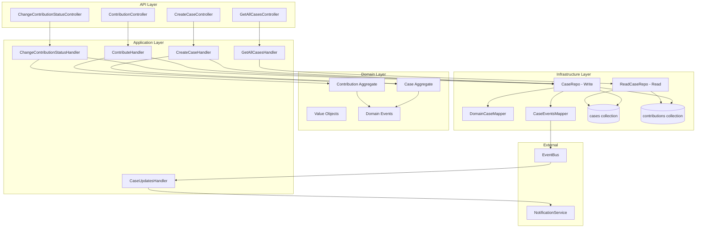

# Cases Module - Complete Technical Documentation

## Overview

The **Cases** module manages charity cases and contributions using **Domain-Driven Design (DDD)**, **CQRS**, and **Event-Driven Architecture**. It uses MongoDB with separate collections for cases and contributions.

## Architecture Diagram



---

## Architecture Layers

### 1. Domain Layer (`/internal/domain`)

#### **Domain Models**

**Case Aggregate** ([Case.kt](file:///Users/hassanibrahim/IdeaProjects/charity_hub/oldSystem/charity-hub-master/src/main/kotlin/com/sohbt_aljannah/cases/internal/domain/model/Case.kt))
- **Aggregate Root** with `CaseCode` as identifier
- **Properties:**
  - `caseCode: CaseCode` - Unique integer code
  - `title: Title` - Case title (value object)
  - `description: Description` - Case description (value object)
  - `goal: Goal` - Fundraising goal (value object)
  - `status: Status` - DRAFT | OPENED | CLOSED
  - `acceptZakat: Boolean` - Whether case accepts Zakat
  - `tags: Tags` - Collection of tags
  - `documents: Documents` - Collection of document URLs
  - `contributions: Contributions` - Collection of contributions
  - `creationDate: Date`
  - `lastUpdated: Date`

- **Business Methods:**
  - `newCase(probs)` - Factory method, raises `CaseCreated` + `CaseOpened` events
  - `update(...)` - Updates case fields, raises `CaseUpdated`
  - `delete(caseRepo)` - Only for DRAFT status
  - `open()` - Transitions DRAFT → OPENED, raises `CaseOpened`
  - `close()` - Transitions OPENED → CLOSED, raises `CaseClosed`
  - `contribute(contributorId, amount)` - Creates contribution, raises `ContributionMade`

**Contribution Aggregate** ([Contribution.kt](file:///Users/hassanibrahim/IdeaProjects/charity_hub/oldSystem/charity-hub-master/src/main/kotlin/com/sohbt_aljannah/cases/internal/domain/model/Contribution.kt))
- **Aggregate Root** with `ContributionId` (UUID) as identifier
- **Properties:**
  - `contributorId: UUID` - User who made contribution
  - `caseId: CaseCode` - Associated case
  - `amount: Amount` - Contribution amount (value object)
  - `contributionStatus: ContributionStatus` - PLEDGED | PAID | CONFIRMED
  - `contributionDate: Date`

- **Business Methods:**
  - `new(...)` - Factory method, creates with PLEDGED status
  - `pay()` - Transitions PLEDGED → PAID, raises `ContributionPaid`
  - `confirm()` - Transitions PAID → CONFIRMED, raises `ContributionConfirmed`

#### **Value Objects**

- **CaseCode** - Wraps `Int` for case unique code
- **Title** - Wraps `String` for case title
- **Description** - Wraps `String` for description
- **Goal** - Wraps `Int` for fundraising goal
- **Amount** - `Amount(value: Int, type: AmountType)` with validation (min 0, max 9999999)
- **Tags** - Collection wrapper for `List<Tag>`
- **Documents** - Collection wrapper for `List<Document>`
- **Contributions** - Collection wrapper with `totalValue()`, `numberOfContributions()`, `addContribution()`

#### **Enums**

- **Status**: `DRAFT`, `OPENED`, `CLOSED`
- **ContributionStatus**: `PLEDGED`, `PAID`, `CONFIRMED`
- **AmountType**: `MemberDueAmount`, `NetworkDueAmount`

#### **Validation Rules**

| Value Object | Rule | Error Message |
|--------------|------|---------------|
| **Title** | Length: 5-100 | "Title must be between 5 and 100 characters" |
| **Description** | Length: 5-2000 | Domain validation messages |
| **Goal** | Range: 100-9999999 | Domain validation messages |
| **Amount** | Min: 0, Max: 9999999 | "\$value is invalid, should be within \$minAmount - \$maxAmount" |

**Validation Implementation:**
```kotlin
// Title validation
data class Title(val value: String) {
    init {
        require(value.length in 5..100) {
            "Title must be between 5 and 100 characters"
        }
    }
}

// Goal validation
data class Goal(val value: Int) {
    init {
        assertNotTooSmall(value, 100, "Goal")
        assertNotTooBig(value, 9999999, "Goal")
    }
}
```

#### **Domain Events** (`/domain/events`)

All inherit from `CaseEvent`:
- **CaseCreated** - Raised when case is created
- **CaseOpened** - Raised when case transitions to OPENED
- **CaseClosed** - Raised when case transitions to CLOSED
- **CaseUpdated** - Raised when case fields are updated
- **ContributionMade** - Raised when user contributes
- **ContributionPaid** - Raised when contribution is paid
- **ContributionConfirmed** - Raised when contribution is confirmed
- **ContributionReminded** - Raised for payment reminders (not in domain model)

#### **Domain Contracts**

- **ICaseRepo** - Repository interface for aggregates
- **INotificationService** - External notification service contract

---

### 2. Application Layer (`/internal/application`)

#### **Commands & Handlers** (`/commands`)

| Command | Handler | Description |
|---------|---------|-------------|
| `CreateCase` | `CreateCaseHandler` | Creates new case (DRAFT or OPENED) |
| `UpdateCase` | `UpdateCaseHandler` | Updates case fields |
| `DeleteDraftCase` | `DeleteDraftCaseHandler` | Deletes DRAFT cases only |
| `ChangeCaseStatus` | `ChangeCaseStatusHandler` | Opens or closes a case |
| `Contribute` | `ContributeHandler` | Creates contribution for a case |
| `ChangeContributionStatus` | `ChangeContributionStatusHandler` | Pays or confirms contribution |

**Example: CreateCaseHandler**
```kotlin
suspend fun handle(command: CreateCase): CaseResponse {
    val newCase = Case.newCase(
        probs = NewCaseProbs(
            caseCode = caseRepo.nextCaseCode(), // Auto-increment
            status = if (command.publish) Status.OPENED else Status.DRAFT,
            ...
        )
    )
    caseRepo.save(newCase) // Saves + publishes events
    return CaseResponse(caseCode = newCase.caseCode.value)
}
```

#### **Queries & Handlers** (`/queries`)

| Query | Handler | Description |
|-------|---------|-------------|
| `GetCaseQuery` | `GetCaseHandler` | Gets single case by code |
| `GetAllCasesQuery` | `GetAllCasesHandler` | Gets all non-draft cases with pagination |
| `GetDraftCases` | `GetDraftCasesHandler` | Gets all draft cases |

#### **Event Handlers** (`/eventHandlers`)

- **CaseUpdatesHandler** - Subscribes to `CaseOpened`, `CaseClosed`, `ContributionMade` → sends notifications
- **FCMTokenUpdatedHandler** - Updates FCM tokens (not case-specific)

---

### 3. Infrastructure Layer (`/internal/infrastructure`)

#### **Repositories** (`/repositories`)

**CaseRepo (Write Repository)** - Implements `ICaseRepo`
- **Collections:**
  - `cases` - Stores `CaseEntity`
  - `contributions` - Stores `ContributionEntity`

- **Methods:**
  - `nextCaseCode()` - Gets last code + 1 (starts at 20040)
  - `getByCode(caseCode)` - Loads aggregate with contributions
  - `save(case)` - **Bulk upserts** all contributions + saves case + **publishes events to EventBus**
  - `save(contribution)` - Saves single contribution + publishes events
  - `delete(caseCode)` - Deletes case (DRAFT only)
  - `getContributionById(id)` - Loads single contribution

**Key Pattern:** Uses **bulk write with upsert** for contributions when saving a case:
```kotlin
contributions.bulkWrite(case.contributions().map {
    replaceOne(
        ContributionEntity::_id eq it.id.toString(),
        domainContributionMapper.toDB(it),
        ReplaceOptions().apply { upsert(true) }
    )
})
```

**ReadCaseRepo (Read Repository)**
- Optimized for queries, bypasses domain models
- **Methods:**
  - `getByCode(code)` - Returns `CaseEntity`
  - `getByCodes(codes)` - Batch fetch
  - `search(offset, limit, filter)` - Paginated search (excludes DRAFT)
  - `getContributionsByCaseCode(caseCode)` - All contributions for a case
  - `getContributions(contributorId)` - User's contributions
  - `getNotConfirmedContributions(contributorId)` - Pending contributions
  - `getDraftCases()` - All drafts

#### **Database Entities** (`/model`)

**CaseEntity**
```kotlin
data class CaseEntity(
    val code: Int,
    val title: String,
    val description: String,
    val goal: Int,
    val collected: Int, // Denormalized total
    val status: Int, // 1=DRAFT, 2=OPENED, 3=CLOSED
    val acceptZakat: Boolean,
    val creationDate: Long,
    val lastUpdated: Long,
    val tags: List<String>,
    val documents: List<String>,
    val contributions: Int // Denormalized count
)
```

**ContributionEntity**
```kotlin
data class ContributionEntity(
    val _id: String, // UUID as string
    val contributorId: String, // UUID as string
    val caseCode: Int,
    val amount: Int,
    val status: Int, // 1=PLEDGED, 2=PAID, 3=CONFIRMED
    val contributionDate: Long
)
```

#### **Mappers** (`/mappers`)

| Mapper | Purpose |
|--------|---------|
| `DomainCaseMapper` | `Case` ↔ `CaseEntity` |
| `DomainContributionMapper` | `Contribution` ↔ `ContributionEntity` |
| `EndPointCaseMapper` | `CaseEntity` → `Case` (application model for responses) |
| `DTOContributionMapper` | `ContributionEntity` → `ContributionDTO` |
| `CaseEventsMapper` | Domain events → Public DTOs for EventBus |

**Event Mapping Example:**
```kotlin
object CaseEventsMapper {
    fun map(event: CaseEvent): CaseEventDto {
        return when (event) {
            is CaseCreated -> CaseCreatedDTO(...)
            is ContributionPaid -> ContributionPaidDTO(...)
            ...
        }
    }
}
```

#### **External API** (`/api`)

**CasesAPI** - Public API for other modules (e.g., ledger)
- `getContributions(userId)` - User's contributions as DTOs
- `getNotConfirmedContributions(userId)` - Pending contributions
- `getCasesByCodes(codes)` - Batch fetch cases

---

### 4. API Layer (`/internal/api` - Controllers)

All controllers use Spring Security with role-based access (`@PreAuthorize`).

| Endpoint | Method | Controller | Auth Required |
|----------|--------|------------|---------------|
| `/v1/cases` | POST | `CreateCaseController` | `CREATE_CASES`, `FULL_ACCESS` |
| `/v1/cases` | GET | `GetAllCasesController` | None (public) |
| `/v1/cases/{caseCode}` | GET | `GetCaseController` | None (public) |
| `/v1/cases/{caseCode}` | PUT | `UpdateCaseController` | `UPDATE_CASES`, `FULL_ACCESS` |
| `/v1/cases/{caseCode}/{status}` | POST | `ChangeCaseStatusController` | `CHANGE_CASE_STATUS`, `FULL_ACCESS` |
| `/v1/cases/drafts` | GET | `GetDraftCasesController` | `CREATE_CASES`, `FULL_ACCESS` |
| `/v1/cases/drafts/{caseCode}` | DELETE | `DeleteDraftCaseController` | `CREATE_CASES`, `FULL_ACCESS` |
| `/v1/cases/{caseCode}/contributions` | POST | `ContributionController` | Authenticated user |
| `/v1/contributions/{id}/{type}` | POST | `ChangeContributionStatusController` | Implied auth |

**Path Variables:**
- `{status}` in `ChangeCaseStatusController`: `"open"` or `"close"`
- `{type}` in `ChangeContributionStatusController`: `"pay"` or `"confirm"`

**Example Controller:**
```kotlin
@PostMapping("/v1/cases/{caseCode}/contributions")
suspend fun contribute(
    @PathVariable caseCode: Int,
    @AuthenticationPrincipal accessTokenPayload: AccessTokenPayload,
    @RequestBody contributeRequest: ContributeRequest
): ResponseEntity<*> {
    val response = contributeHandler.handle(
        Contribute(contributeRequest.amount, accessTokenPayload.getUserId(), caseCode)
    )
    return ResponseEntity.ok(response)
}
```

---

## Cross-Module Communication

### Public Event DTOs ([CaseEvents.kt](file:///Users/hassanibrahim/IdeaProjects/charity_hub/oldSystem/charity-hub-master/src/main/kotlin/com/sohbt_aljannah/cases/CaseEvents.kt))

Published to `EventBus` for consumption by other modules:

```kotlin
sealed interface CaseEventDto

data class CaseCreatedDTO(val caseCode: Int, val title: String, ...)
data class CaseOpenedDTO(val caseCode: Int, val title: String, ...)
data class CaseClosedDTO(val caseCode: Int, val goal: Int, val contributionsTotal: Int, ...)
data class ContributionMadeDTO(val id: UUID, val contributorId: UUID, val caseCode: Int, val amount: Int)
data class ContributionPaidDTO(val id: UUID, val contributorId: UUID)
data class ContributionConfirmedDTO(val id: UUID, val contributorId: UUID)
data class ContributionRemindedDTO(val id: UUID, val contributorId: UUID)
```

**Consumers:**
- **Ledger Module**: Subscribes to `ContributionPaid`, `ContributionConfirmed`, `ContributionReminded` for notifications
- **Notifications Module**: Receives case/contribution events via `INotificationService`

---

## Data Flow Patterns

### Write Path (Commands)

1. **Controller** receives HTTP request
2. Maps request to **Command** object
3. Invokes **CommandHandler**
4. Handler loads **Aggregate** from `CaseRepo`
5. Aggregate executes **business logic** and raises **domain events**
6. Handler calls `caseRepo.save(aggregate)`
7. Repository:
   - Bulk upserts **contributions** (if any)
   - Saves **case entity**
   - Maps domain events to **public DTOs**
   - Publishes to **EventBus**
8. Returns **response DTO** to controller

### Read Path (Queries)

1. **Controller** receives HTTP request
2. Maps to **Query** object
3. Invokes **QueryHandler**
4. Handler uses **ReadCaseRepo** (bypasses domain models)
5. Repository queries MongoDB directly
6. Maps `CaseEntity` to response DTO
7. Returns to controller

### Event Handling Path

1. **Domain event** published to EventBus (after save)
2. **CaseUpdatesHandler** receives event
3. Calls **INotificationService** to send push notifications
4. Other modules subscribe to events (e.g., Ledger)

---

## Key Design Patterns

### 1. CQRS (Command Query Responsibility Segregation)
- **Write Model**: `CaseRepo` with domain aggregates
- **Read Model**: `ReadCaseRepo` with optimized queries on entities

### 2. Aggregate Pattern
- `Case` is aggregate root with `Contributions` collection
- `Contribution` can also act as standalone aggregate for status changes

### 3. Event Sourcing (Partial)
- Domain events raised but not stored
- Events published to EventBus for cross-module communication
- Repository publishes events **after** persistence

### 4. Repository Pattern
- Interface (`ICaseRepo`) defined in domain
- Implementation in infrastructure
- Separate read/write repositories

### 5. Value Objects
- Immutable wrappers for primitives
- Validation in constructors
- Examples: `Title`, `Amount`, `CaseCode`

### 6. Mapper Pattern
- **4 mapper types** for different contexts:
  - Domain ↔ Database (`DomainCaseMapper`)
  - Domain → API Response (`EndPointCaseMapper`)
  - Entity → DTO for cross-module (`DTOContributionMapper`)
  - Domain Events → Public Events (`CaseEventsMapper`)

---

## Important Implementation Details

### 1. Case Code Generation
```kotlin
override suspend fun nextCaseCode(): Int {
    val nextCode = cases.find()
        .sort(descending(CaseEntity::code))
        .limit(1)
        .first()?.code ?: 20039
    return nextCode + 1
}
```
- **No atomic counter** - race condition risk
- Hardcoded fallback: `20039`

### 2. Contribution Upsert Pattern
When saving a case with contributions:
```kotlin
contributions.bulkWrite(case.contributions().map {
    replaceOne(
        ContributionEntity::_id eq it.id.toString(),
        domainContributionMapper.toDB(it),
        ReplaceOptions().apply { upsert(true) }
    )
})
```
- **Upsert** ensures idempotency
- All contributions saved in **bulk**

### 3. Denormalization
`CaseEntity` stores:
- `collected: Int` - Total contributions amount
- `contributions: Int` - Count of contributions

**Calculated from `Contributions` collection on save:**
```kotlin
collected = domain.totalContributions()
contributions = domain.numberOfContributions()
```

### 4. Status Transitions
**Case:**
- DRAFT → OPENED (via `open()`)
- OPENED → CLOSED (via `close()`)
- No CLOSED → OPENED reversal

**Contribution:**
- PLEDGED → PAID → CONFIRMED (linear progression)
- No reversal

### 5. Event Publishing
Events published **AFTER** database save:
```kotlin
caseRepo.save(case)
case.occurredEvents()
    .map { CaseEventsMapper.map(it as CaseEvent) }
    .forEach { eventBus.push(it) }
```
- **Not transactional** - events may publish even if save fails
- Events cleared after publishing

---

## Missing Features / Issues

1. **No transactions** - Contributions and cases saved separately, no rollback
2. **Race condition** in `nextCaseCode()` - concurrent creates may collide
3. **No idempotency keys** for contributions
4. **Event reliability** - Events published **after** save, not atomic
5. **Hardcoded initial code** - Should be configurable
6. **No soft delete** - Delete is permanent
7. **Contribution reminders** - `ContributionRemindedDTO` event exists but no domain logic for it
8. **CreateCaseHandler bug** - Line 22 uses `command.title` for `description` instead of `command.description`

---

## Migration Checklist

- [ ] Implement **transactions** using MongoDB replica set
- [ ] Use **atomic counter** for case codes or distributed ID generator
- [ ] Add **@Transactional** to command handlers
- [ ] Ensure event publishing is **transactional** (outbox pattern or transactional events)
- [ ] Add **contribution idempotency** (e.g., idempotency key header)
- [ ] Make initial case code **configurable** (from properties)
- [ ] Implement **soft delete** with `deletedAt` timestamp
- [ ] Fix `CreateCaseHandler` description bug
- [ ] Add validation for contribution amounts (currently only in `Amount` value object)
- [ ] Implement **reminder scheduling** for unpaid contributions
- [ ] Add **audit fields** (createdBy, updatedBy)
- [ ] Ensure **endpoint security** is consistent across all controllers
